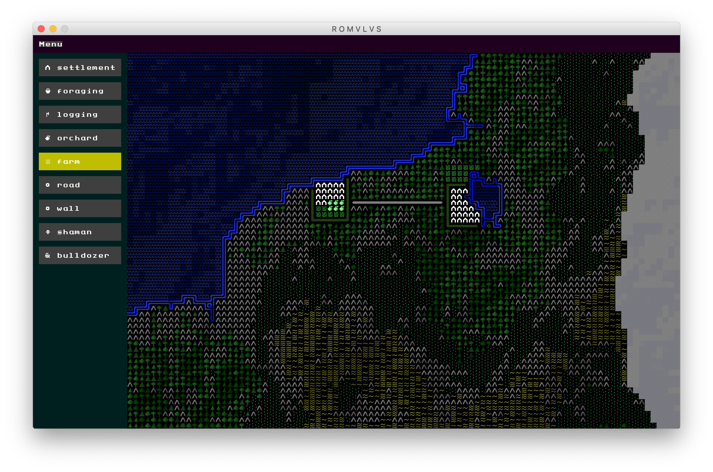

---
# Feel free to add content and custom Front Matter to this file.
# To modify the layout, see https://jekyllrb.com/docs/themes/#overriding-theme-defaults

layout: home
---

ROMVLVS is a simulation game combining detailed city dynamics and huge maps. 
It is currently in development with an alpha version nearly available for download.

## How it works
Select buildings you want to build and place them on the map.

## Downloads
See the [Downloads](downloads.html) section.

## Upcoming Features
The current alpha version has very limited features, but some improvements that I'm 
working on include:
- Economic engine. Right now buildings don't cost anything and won't produce anything, 
but the idea is to include interactions between buildings and the environment.
- Windows and Linux versions. Currently only macOS is supported.
- Huge maps. The current size is 96x64 tiles, with an intermediate goal of 1024x1024 tiles.
- Loading and saving games.
- Lots of buildings.

## Screenshots

